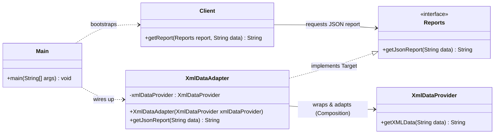

# Adapter Design Pattern — Data Converter Demo

A clean Java implementation of the **Adapter** structural design pattern, modelled as an XML-to-JSON report converter that bridges a modern client application and a legacy/third-party XML library.

---

## Pattern Summary

> **"Convert the interface of a class into another interface clients expect. 
> Adapter lets classes work together that couldn't otherwise because of incompatible interfaces."**
> — Gang of Four

The Adapter pattern is useful when:
- You want to use an existing class, but its interface does not match the one you need.
- You want to build a reusable class that cooperates with unrelated or unforeseen classes (that is, classes that don't necessarily share compatible interfaces).
- You need to integrate legacy components or third-party libraries without altering their source code.

---

## UML Class Diagram



---

## Project Structure

```
adapter-design-pattern/
├── run.ps1                          ← Compile, run & auto-clean (PowerShell)
├── README.md                        ← Documentation
└── src/main/java/
    ├── Main.java                    ← Application Entrypoint
    ├── client/
    │   └── Client.java              ← Expects JSON reports
    ├── reports/
    │   ├── Reports.java             ← Target Interface (JSON-based)
    │   └── XmlDataAdapter.java      ← The Adapter (implements Reports)
    └── thirdpartylibrary/
        └── XmlDataProvider.java     ← Adaptee (Legacy XML provider)
```

---

## Class Breakdown

### 1. Target Interface: [Reports](file:///c:/Users/Asim/OneDrive/Desktop/projects/LLD-PROJECTS/design-patterns/adapter-design-pattern/src/main/java/reports/Reports.java)
Defines the interface that the client application understands and uses. It requires reports to be formatted as JSON strings:
```java
public interface Reports {
    String getJsonReport(String data);
}
```

### 2. Client: [Client](file:///c:/Users/Asim/OneDrive/Desktop/projects/LLD-PROJECTS/design-patterns/adapter-design-pattern/src/main/java/client/Client.java)
Works directly with the `Reports` interface to retrieve information, completely insulated from the details of how the data is generated or formatted under the hood.
```java
public class Client {
    public String getReport(Reports report, String data) {
        return report.getJsonReport(data);
    }
}
```

### 3. Adaptee (Third-Party): [XmlDataProvider](file:///c:/Users/Asim/OneDrive/Desktop/projects/LLD-PROJECTS/design-patterns/adapter-design-pattern/src/main/java/thirdpartylibrary/XmlDataProvider.java)
A legacy or third-party service that operates entirely on XML. It accepts raw colon-separated strings and returns XML-formatted documents.
```java
public class XmlDataProvider {
    public String getXMLData(String data) {
        String name = data.split(":")[0];
        String id = data.split(":")[1];
        return "<data><name>" + name + "</name><id>" + id + "</id></data>";
    }
}
```

### 4. Adapter: [XmlDataAdapter](file:///c:/Users/Asim/OneDrive/Desktop/projects/LLD-PROJECTS/design-patterns/adapter-design-pattern/src/main/java/reports/XmlDataAdapter.java)
The glue that implements `Reports` (Target) and wraps `XmlDataProvider` (Adaptee). It translates incoming requests, invokes the Adaptee's functionality, parses the legacy XML format, and formats the output into clean JSON.
```java
public class XmlDataAdapter implements Reports {
    private XmlDataProvider xmlDataProvider;

    public XmlDataAdapter(XmlDataProvider xmlDataProvider) {
        this.xmlDataProvider = xmlDataProvider;
    }

    @Override
    public String getJsonReport(String data) {
        // 1. Fetch XML from legacy provider
        String xmlData = xmlDataProvider.getXMLData(data);
        
        // 2. Parse XML elements
        String name = xmlData.substring(xmlData.indexOf("<name>") + 6, xmlData.indexOf("</name>"));
        String id = xmlData.substring(xmlData.indexOf("<id>") + 4, xmlData.indexOf("</id>"));
        
        // 3. Adapt and return as JSON
        String jsonData = "{\"name\":\"" + name + "\",\"id\":\"" + id + "\"}";
        return jsonData;
    }
}
```

---

## How to Run

### Requirements
- JDK 11 or later
- PowerShell 5.1+ (Windows) or PowerShell 7+ (cross-platform)

### Execution
Execute the automated PowerShell runner from the project root directory:
```powershell
.\run.ps1
```

The script will:
1. Verify Java compiler (`javac`) presence.
2. Compile all source files into a temporary `out/` directory.
3. Execute the `Main` class.
4. **Clean up automatically**: Deletes the compiled `.class` files in the `out/` directory immediately after the execution finishes to keep your workspace clean.

### Expected Output
```
+------------------------------------------+
|    Adapter Pattern - Data Converter      |
+------------------------------------------+

[INFO] Using: javac 21.0.9
[INFO] Output directory: ...\adapter-design-pattern\out
[INFO] Found 5 source file(s)

[STEP] Compiling...
[OK]   Compilation successful.

[STEP] Running Main...
---------------------------------------------

{"name":"JHON","id":"123"}

---------------------------------------------
[DONE] Demo finished.

[STEP] Cleaning up output directory...
[OK]   Deleted '...\adapter-design-pattern\out'.
```

---

## Comparison: Object Adapter vs. Class Adapter

There are two primary ways to implement the Adapter pattern:

| Metric | Object Adapter (Implemented Here) | Class Adapter |
|---|---|---|
| **Mechanism** | Uses **Composition** (holds instance of Adaptee) | Uses **Multiple Inheritance** (extends Target and Adaptee) |
| **Java Support** | fully supported (Java allows class composition and interface implementation) | Not supported directly in Java (no multiple class inheritance) |
| **Flexibility** | Can adapt the Adaptee and any of its subclasses | Binds tightly to the specific Adaptee class |
| **Override Behavior** | Harder to override Adaptee methods (must subclass Adaptee first) | Easy to override Adaptee methods by direct inheritance |

---

## Further Reading
- *Design Patterns: Elements of Reusable Object-Oriented Software* — Gamma, Helm, Johnson, Vlissides (GoF)
- **Adapter vs. Facade**: Adapter makes two existing interfaces work together; Facade defines a new, simpler interface for a whole subsystem.
- **Adapter vs. Decorator**: Adapter changes the interface of an object; Decorator enhances/adds responsibility to an object without changing its interface.
