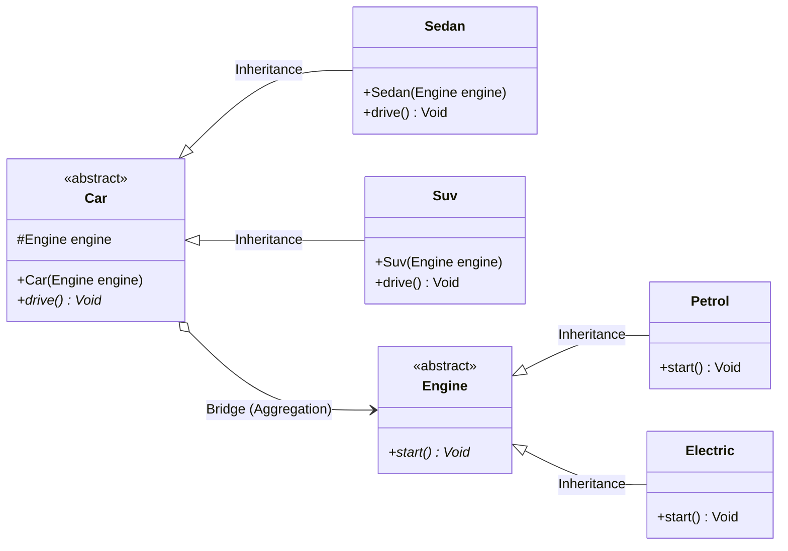

# Bridge Design Pattern

This project demonstrates the **Bridge Design Pattern** in Java.

The Bridge pattern is a structural design pattern that lets you split a large class or a set of closely related classes into two separate hierarchies—**Abstraction** and **Implementation**—which can be developed and varied independently of each other.

---

## The Problem: Class Explosion
Suppose we have a set of `Car` classes (e.g., `Sedan`, `SUV`) and a set of `Engine` types (e.g., `Petrol`, `Electric`). 
If we use standard inheritance, we would have to create separate subclasses for every combination of car and engine:
- `PetrolSedan`
- `ElectricSedan`
- `PetrolSUV`
- `ElectricSUV`

Adding a new car type (e.g., `Hatchback`) or a new engine type (e.g., `Hybrid`) would lead to a combinatorial explosion of classes ($N \times M$).

## The Solution: Bridge Pattern
Instead of hardcoding the engine type inside each car subclass, the Bridge pattern introduces an interface/abstract class for the `Engine` and passes it to the `Car` constructor via composition. 
The relationship (association) between `Car` and `Engine` acts as a **bridge**, decoupled from specific implementations.

Now:
- We can add new car types (e.g., `Hatchback` extending `Car`) without changing any engine code.
- We can add new engine types (e.g., `Hybrid` extending `Engine`) without changing any car code.
- The number of classes grows linearly ($N + M$) instead of quadratically ($N \times M$).

---

## Class Structure & Roles in this Project

1. **Abstraction**: [Car](file:///c:/Users/Asim/OneDrive/Desktop/projects/LLD-PROJECTS/design-patterns/bridge-design-pattern/src/main/java/car/Car.java)
   - Abstract class that defines the control interface and references an `Engine` object.
2. **Refined Abstractions**:
   - [Sedan](file:///c:/Users/Asim/OneDrive/Desktop/projects/LLD-PROJECTS/design-patterns/bridge-design-pattern/src/main/java/car/Sedan.java) - A specific type of Car.
   - [Suv](file:///c:/Users/Asim/OneDrive/Desktop/projects/LLD-PROJECTS/design-patterns/bridge-design-pattern/src/main/java/car/Suv.java) - A specific type of Car.
3. **Implementor (Interface/Abstract Class)**: [Engine](file:///c:/Users/Asim/OneDrive/Desktop/projects/LLD-PROJECTS/design-patterns/bridge-design-pattern/src/main/java/engine/Engine.java)
   - Defines the interface for all engine implementations.
4. **Concrete Implementors**:
   - [Petrol](file:///c:/Users/Asim/OneDrive/Desktop/projects/LLD-PROJECTS/design-patterns/bridge-design-pattern/src/main/java/engine/Petrol.java) - Concrete Petrol engine implementation.
   - [Electric](file:///c:/Users/Asim/OneDrive/Desktop/projects/LLD-PROJECTS/design-patterns/bridge-design-pattern/src/main/java/engine/Electric.java) - Concrete Electric engine implementation.

---

## UML Class Diagram



---

## How to Run

A PowerShell script `run.ps1` is provided to automate compilation, execution, and cleanup.

### Prerequisites
- Java Development Kit (JDK) installed and configured in your environment path (`javac` and `java` commands should be accessible).
- PowerShell.

### Run Script
Open PowerShell in the project root directory and run:

```powershell
# Bypass execution policy if needed to run the script
powershell -ExecutionPolicy Bypass -File .\run.ps1
```

This script will:
1. Compile all Java source files under `src/main/java` into a temporary `bin/` directory.
2. Execute the `Main` class.
3. Automatically delete the `bin/` directory afterwards.
