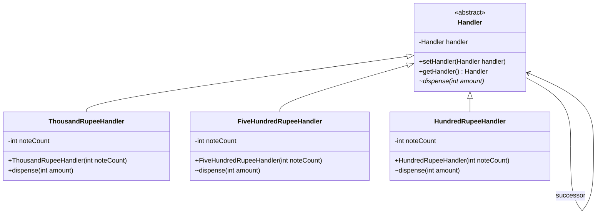

# Chain of Responsibility Pattern - ATM Dispenser

This repository contains an implementation of the Chain of Responsibility behavioral design pattern, demonstrating a multi-denomination ATM cash dispensing system.

## Design Pattern Description

The **Chain of Responsibility** pattern is a behavioral design pattern that allows a request to be passed along a chain of handlers. Upon receiving a request, each handler decides either to process the request or to pass it to the next handler in the chain.

In this implementation:
- **Handler**: An abstract base class that maintains a reference to the next handler in the chain (successor) and defines the `dispense` method.
- **Concrete Handlers** (`ThousandRupeeHandler`, `FiveHundredRupeeHandler`, `HundredRupeeHandler`): Implement the `dispense` method for specific denominations. Each handler dispenses notes for its denomination and forwards the remaining amount to the next handler in the chain.

## Class Diagram (UML)



## Running the Application

A PowerShell script `run.ps1` is provided to compile, run, and clean up the class files.

To run the application, execute:
```powershell
.\run.ps1
```
