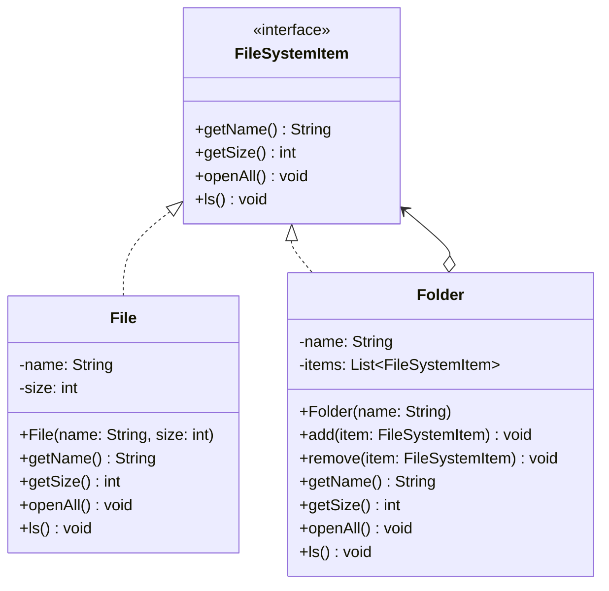

# Composite Design Pattern - Filesystem Implementation

This project implements a filesystem structure using the Composite Design Pattern.

## Design Pattern Description

The Composite Design Pattern is a structural design pattern that lets you compose objects into tree structures to represent part-whole hierarchies. It allows clients to treat individual objects and compositions of objects uniformly.

### Key Components

1. **Component (`FileSystemItem`)**
   - The interface defining the common operations for both simple and complex objects in the composition.
   - Operations include `getName()`, `getSize()`, `openAll()`, and `ls()`.

2. **Leaf (`File`)**
   - Represents the leaf elements of the composition. A leaf has no sub-elements.
   - Implements the component operations directly based on its own attributes (e.g., returning its own name and size).

3. **Composite (`Folder`)**
   - Represents a complex container that can contain both leaf elements and other composite elements.
   - Implements the component operations by delegating and accumulating results from its child components (e.g., recursively calculating the total size of all child files and folders).
   - Provides child-management operations like `add()` and `remove()`.

## UML Class Diagram



## Running the Application

A PowerShell script is provided to compile all Java source files, run the test main class, and clean up the compiled artifacts.

Execute the following command in PowerShell:

```powershell
./run.ps1
```
