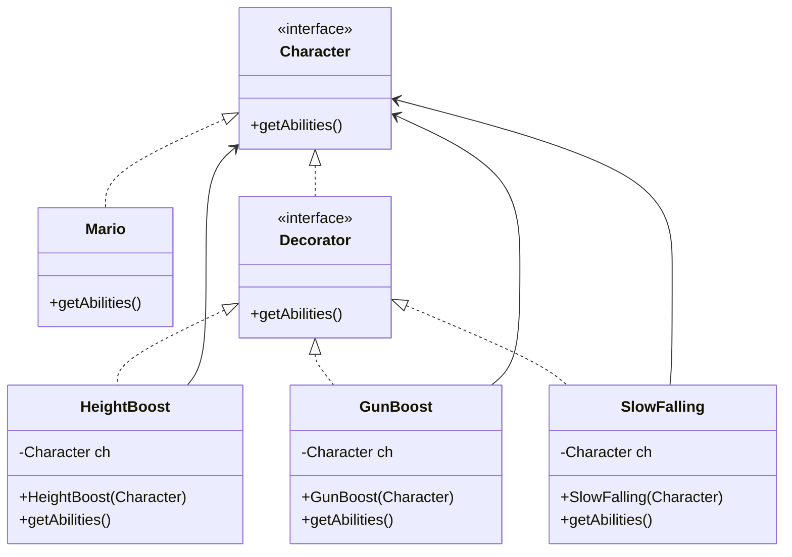

# Decorator Pattern

## Overview
The Decorator pattern attaches additional responsibilities to an object dynamically by wrapping it with one or more decorator objects. It provides a flexible alternative to subclassing for extending behavior.

## Key Ideas
- Composition over inheritance: decorators hold a reference to a component.
- Open/closed principle: new behaviors can be added without changing existing classes.
- Behavior stacking: multiple decorators can be combined to build features at runtime.

## Participants
- Component: the common interface for objects that can be decorated.
- Concrete Component: the base object being decorated.
- Decorator: an abstract wrapper that implements the component interface and delegates work.
- Concrete Decorators: add behavior before or after delegating.

## When to Use
- You need to add features at runtime without creating many subclasses.
- You want to combine behaviors in different orders or combinations.

## UML Diagram


## Run
Use the PowerShell script to compile and run the example, then clean up build output:

```powershell
./run.ps1
```
