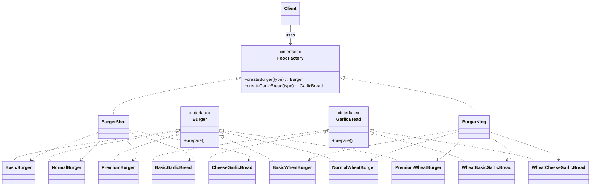

# Factory Design Pattern - Burger Franchises

## Problem Statement
We have multiple burger franchises, and each franchise prepares the same menu categories in its own way. The client should be able to order a burger or garlic bread by type (basic, normal, premium, or cheese) without knowing the concrete class that gets created. The system must:

- Support multiple franchises (BurgerShot, BurgerKing) that produce burgers and garlic breads.
- Keep creation logic inside each franchise, not in the client.
- Allow new franchises or new product variants to be added with minimal client changes.

## Domain Rules
- BurgerShot produces regular-base burgers and garlic breads.
- BurgerKing produces wheat-based burgers and garlic breads.
- Burger types include basic, normal, and premium.
- Garlic bread types include basic and cheese.

## UML Diagram

