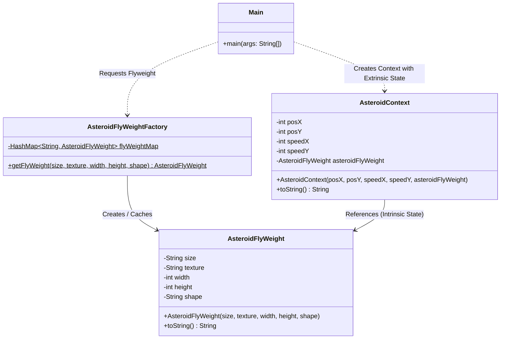

# Flyweight Design Pattern - Asteroid Game Example

This project implements the **Flyweight Design Pattern** in Java, simulating a scenario where hundreds of thousands of asteroids are rendered in a game. The pattern is used to optimize memory usage by sharing common (intrinsic) data among objects instead of storing duplicates.

---

## 🌌 The Problem

Imagine rendering millions of asteroids in space. Each asteroid has:
- **Unique coordinates and speeds** (extrinsic state): `posX`, `posY`, `speedX`, `speedY`.
- **Large and repetitive graphical assets/metadata** (intrinsic state): `size`, `texture`, `width`, `height`, `shape`.

If we create a separate object containing all this data for every single asteroid, the application will quickly run out of memory (RAM). 

---

## 💡 The Solution: Flyweight Pattern

The Flyweight pattern splits the state of an object into two parts:
1. **Intrinsic State (Shared)**: Constant, immutable, and independent of context (e.g., shape, size, texture metadata). This is stored inside the **Flyweight object** and shared across all instances of similar type.
2. **Extrinsic State (Unique)**: Varies depending on context and changes frequently (e.g., position, speed). This is stored outside the flyweight (in a **Context object**) and passed to it when needed.

---

## 🛠️ Code Structure

- [Main.java](file:///c:/Users/Asim/OneDrive/Desktop/projects/LLD-PROJECTS/design-patterns/flyweight-design-pattern/src/main/java/Main.java): The client program that simulates the creation of multiple asteroids.
- [AsteroidFlyWeight.java](file:///c:/Users/Asim/OneDrive/Desktop/projects/LLD-PROJECTS/design-patterns/flyweight-design-pattern/src/main/java/flyweight/AsteroidFlyWeight.java): The concrete flyweight class storing shared (intrinsic) properties like size, texture, and shape.
- [AsteroidFlyWeightFactory.java](file:///c:/Users/Asim/OneDrive/Desktop/projects/LLD-PROJECTS/design-patterns/flyweight-design-pattern/src/main/java/factory/AsteroidFlyWeightFactory.java): The factory responsible for caching and reusing `AsteroidFlyWeight` instances based on a unique key.
- [AsteroidContext.java](file:///c:/Users/Asim/OneDrive/Desktop/projects/LLD-PROJECTS/design-patterns/flyweight-design-pattern/src/main/java/context/AsteroidContext.java): Represents the unique context of an asteroid, combining extrinsic data (`posX`, `posY`, etc.) with a reference to the shared flyweight object.

---

## 📊 UML Class Diagram

Below is the UML class diagram representing the system architecture:



---

## 🚀 Execution & Cleanup

A PowerShell script [run.ps1](file:///c:/Users/Asim/OneDrive/Desktop/projects/LLD-PROJECTS/design-patterns/flyweight-design-pattern/run.ps1) is provided to quickly compile, execute, and automatically clean up the compiler artifacts.

To run the program:
1. Open PowerShell in the root directory.
2. Execute the runner script:
   ```powershell
   .\run.ps1
   ```

### Output Example
```text
Compiling Java source files...
Running Main program...
Asteroid [posX=1, posY=1, speedX=1, speedY=1, asteroidFlyWeight=Asteroid [size=small, texture=rocky, width=10, height=10, shape=irregular]]
Asteroid [posX=2, posY=2, speedX=2, speedY=2, asteroidFlyWeight=Asteroid [size=small, texture=rocky, width=10, height=10, shape=irregular]]
Asteroid [posX=3, posY=3, speedX=3, speedY=3, asteroidFlyWeight=Asteroid [size=large, texture=icy, width=20, height=20, shape=spherical]]
Cleaning up compiled artifacts...
```
*(Notice how the same `small rocky irregular` flyweight instance is shared between Asteroid 1 and Asteroid 2, optimizing memory).*
