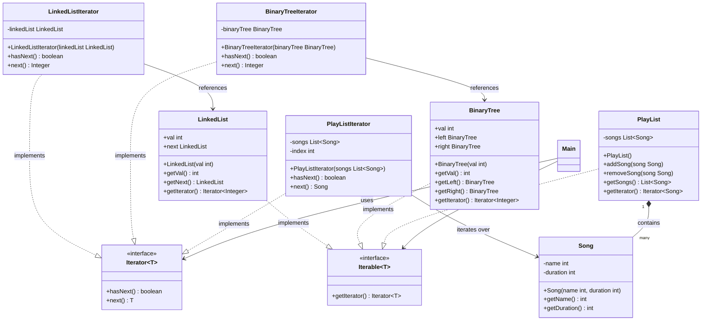

# Iterator Design Pattern - Java Implementation

This repository demonstrates the **Iterator Design Pattern** in Java, showcasing how to decouple collection traversal logic from the collection structure itself. It implements custom iterators for three distinct data structures: a **Singly Linked List**, a **Binary Tree** (left-traversal prototype), and a **Song Playlist**.

---

## 📖 What is the Iterator Design Pattern?

The **Iterator Pattern** is a behavioral design pattern that lets you traverse elements of a collection without exposing its underlying representation (list, tree, stack, queue, etc.).

### Key Concepts & Benefits:
1. **Single Responsibility Principle**: Traversal algorithms are extracted into separate classes (Iterators), making the collections cleaner and focused purely on data management.
2. **Open/Closed Principle**: You can implement new types of collections or traversal algorithms and pass them to existing client code without breaking anything.
3. **Uniform Traversal Interface**: Clients can traverse different types of collections using the exact same standard interface (`hasNext()` and `next()`), regardless of whether the collection is a tree, a list, or an array list.
4. **Multiple Traversal States**: Since traversal state is stored in the iterator object, multiple traversals can run over the same collection concurrently and independently.

---

## 📐 UML Class Diagram

Below is the class diagram showing the relationship between the Aggregates (collections), their corresponding Iterators, and the Common Interfaces.



---

## 📂 Project Structure

```
iterator-design-pattern/
│
├── src/
│   └── main/
│       └── java/
│           ├── Main.java               # Main entrypoint running the demos
│           ├── datastructures/
│           │   ├── BinaryTree.java     # BinaryTree Aggregate
│           │   ├── LinkedList.java     # LinkedList Aggregate
│           │   └── PlayList.java       # Playlist Aggregate (Contains Songs)
│           │
│           ├── iterators/
│           │   ├── Iterator.java       # Custom Iterator Interface
│           │   ├── Iterable.java       # Custom Iterable Interface
│           │   ├── BinaryTreeIterator.java
│           │   ├── LinkedListIterator.java
│           │   └── PlayListIterator.java
│           │
│           └── models/
│               └── Song.java           # Model class used in Playlist demo
│
├── run.ps1                             # PowerShell script to compile, run, & clean artifacts
└── README.md                           # Project documentation
```

---

## ⚙️ How to Run

A PowerShell script `run.ps1` is provided to automate compilation, execution, and artifact cleanup.

### Prerequisites
- Java Development Kit (JDK 8 or higher) installed.
- PowerShell command-line environment.

### Steps to Run

1. Open a PowerShell terminal in the project directory.
2. Run the script:
   ```powershell
   .\run.ps1
   ```

### What the Script Does:
1. **Compiles**: Creates a temporary `bin/` directory and compiles all Java files recursively.
2. **Executes**: Runs `Main.class` with the compiled classes on the classpath.
3. **Cleans Up**: Deletes the compiled class files and the `bin/` directory automatically, keeping the project directory pristine.

---

## 📝 Demo Walkthrough

Running the project output demonstrates traversal over the structures:

```text
LinkedList Iteration:
1
2
3

BinaryTree Iteration:
1
2

Playlist Iteration:
Song ID: 101, Duration: 180s
Song ID: 102, Duration: 240s
Song ID: 103, Duration: 200s
```
