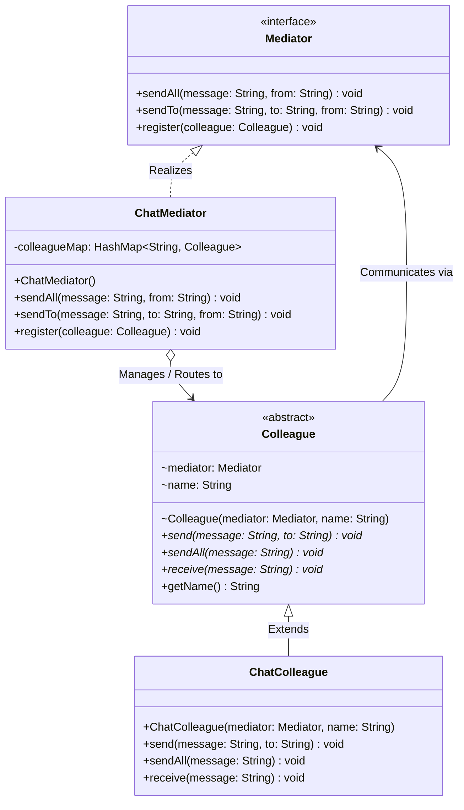
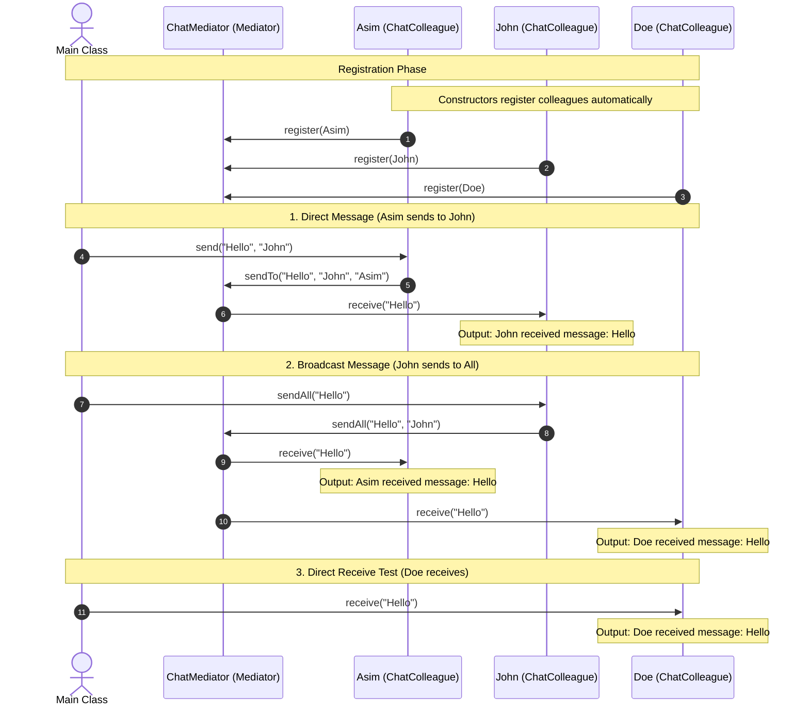

# Mediator Design Pattern - Chat Application

This project implements the **Mediator Design Pattern** in Java. The Mediator pattern is a behavioral design pattern that reduces chaotic dependencies between objects by restricting direct communications between them, forcing them to collaborate only via a mediator object.

---

## 📖 What is the Mediator Design Pattern?

The **Mediator Design Pattern** is used to facilitate communication between different objects (known as **Colleagues**) without them having direct references to each other. Instead of objects interacting directly, they communicate through a centralized **Mediator** object.

### Problem
In complex systems, direct interactions between multiple objects (many-to-many communication) lead to tight coupling. If one object changes, it might break other communicating objects. It also becomes extremely difficult to reuse components since they depend on many other classes.

### Solution
Centralize all inter-object communications inside a Mediator. Objects no longer communicate directly; instead, they send their messages to the mediator, which routes them to the appropriate destination. This transforms a complex **many-to-many** relationship into a simpler, clean **one-to-many** relationship.

---

## 🗺️ UML Diagrams

### Class Diagram

The following diagram illustrates the classes, interfaces, and their relationships within the application:



### Sequence Diagram (Workflow)

Here is the step-by-step sequence of events when a client instantiates the components, registers them, and sends messages:



---

## 📁 Project Structure

The project code is organized as follows:

| File | Package / Location | Role in Mediator Pattern |
| :--- | :--- | :--- |
| [Mediator.java](file:///c:/Users/Asim/OneDrive/Desktop/projects/LLD-PROJECTS/design-patterns/mediator-design-pattern/src/main/java/mediator/Mediator.java) | `mediator` | The abstract Mediator interface defining registration and routing contracts. |
| [ChatMediator.java](file:///c:/Users/Asim/OneDrive/Desktop/projects/LLD-PROJECTS/design-patterns/mediator-design-pattern/src/main/java/mediator/ChatMediator.java) | `mediator` | The concrete Mediator implementation managing the registry of `Colleague` objects. |
| [Colleague.java](file:///c:/Users/Asim/OneDrive/Desktop/projects/LLD-PROJECTS/design-patterns/mediator-design-pattern/src/main/java/colleague/Colleague.java) | `colleague` | The abstract participant base class holding a reference to the `Mediator`. |
| [ChatColleague.java](file:///c:/Users/Asim/OneDrive/Desktop/projects/LLD-PROJECTS/design-patterns/mediator-design-pattern/src/main/java/colleague/ChatColleague.java) | `colleague` | The concrete participant class implementing specific communication workflows. |
| [Main.java](file:///c:/Users/Asim/OneDrive/Desktop/projects/LLD-PROJECTS/design-patterns/mediator-design-pattern/src/main/java/Main.java) | default | The client entry point that orchestrates the objects and initiates the communication. |

---

## ⚙️ Compilation & Execution

A automated script [run.ps1](file:///c:/Users/Asim/OneDrive/Desktop/projects/LLD-PROJECTS/design-patterns/mediator-design-pattern/run.ps1) is provided to quickly compile, execute, and clean up the environment.

### Prerequisites
- Java Development Kit (JDK) installed and configured in your environment path (`javac` and `java` commands).
- PowerShell execution policy set to run scripts.

### Running the Project

Open PowerShell in the project directory and run:

```powershell
.\run.ps1
```

> [!NOTE]
> If you get an execution policy error, bypass it by running:
> `powershell -ExecutionPolicy Bypass -File .\run.ps1`

### What the Script Does:
1. **Discovers** all `.java` files within the `src` directory recursively.
2. **Compiles** them into a temporary `./bin/` directory.
3. **Executes** the `Main` entry point from `./bin/`.
4. **Cleans up** by completely deleting the `./bin/` directory, leaving the project workspace clean.

---

## 🌟 Key Benefits of this Implementation

1. **Reduced Coupling**: Concrete colleagues (`ChatColleague`) only know about the `Mediator` interface. They don't know anything about other colleagues, allowing them to be modified or reused independently.
2. **Centralized Communication Control**: Complex interaction rules (e.g., *don't echo messages back to the sender during a broadcast*, or *route messages to specific recipients*) are encapsulated in one single location: [ChatMediator.java](file:///c:/Users/Asim/OneDrive/Desktop/projects/LLD-PROJECTS/design-patterns/mediator-design-pattern/src/main/java/mediator/ChatMediator.java).
3. **Simplified Object Protocols**: Colleague interfaces are extremely basic, delegates of a simple relationship, keeping code clean.
