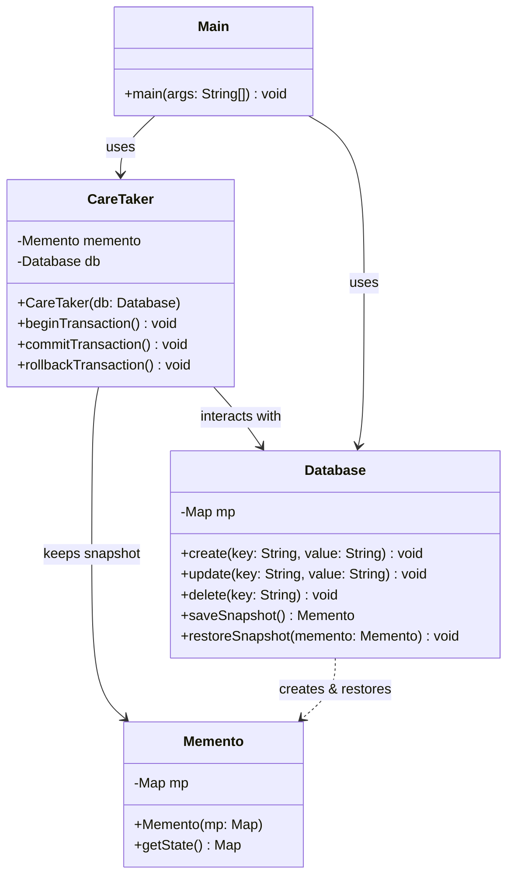

# Memento Design Pattern

A robust demonstration of the **Memento Design Pattern** implemented in Java, showcasing how to capture and restore an object's internal state without violating encapsulation.

---

## 📖 What is the Memento Pattern?

The **Memento Design Pattern** is a behavioral design pattern that allows an object's state to be saved and restored to a previous state. It is primarily used to implement undo/redo mechanisms, rollback transactions, or checkpointing in applications.

### Key Benefits
* **Encapsulation Preservation:** The caretaker doesn't need to know the internal structure of the originator's state, preventing exposure of internal details.
* **Simplified Originator:** The Originator class does not need to manage the history of its states; that responsibility is delegated to the Caretaker.
* **Safe Checkpoints:** Allows state capturing and restoration reliably.

---

## 🧩 Pattern Components & Mapping

This codebase implements transaction management (begin, commit, and rollback) on an in-memory database using the Memento pattern:

1. **Originator ([Database](file:///C:/Users/Asim/OneDrive/Desktop/projects/LLD-PROJECTS/design-patterns/memento-design-pattern/src/main/java/Database.java)):**
   * The object whose state needs to be saved and restored.
   * Creates a snapshot (`Memento`) of its state.
   * Restores its state from a given `Memento`.

2. **Memento ([Memento](file:///C:/Users/Asim/OneDrive/Desktop/projects/LLD-PROJECTS/design-patterns/memento-design-pattern/src/main/java/Memento.java)):**
   * An immutable object that stores the state of the Originator.
   * Protects the saved state from direct manipulation by other objects.

3. **Caretaker ([CareTaker](file:///C:/Users/Asim/OneDrive/Desktop/projects/LLD-PROJECTS/design-patterns/memento-design-pattern/src/main/java/CareTaker.java)):**
   * Responsible for the safe keeping of the `Memento` objects.
   * Initiates transactions, commits (discards snapshot), and triggers rollbacks (restores snapshot).
   * Never directly modifies or inspects the contents of the `Memento`.

4. **Client ([Main](file:///C:/Users/Asim/OneDrive/Desktop/projects/LLD-PROJECTS/design-patterns/memento-design-pattern/src/main/java/Main.java)):**
   * Coordinates the transaction workflow.

---

## 📊 UML Class Diagram

Below is the UML diagram representing the relationships and methods in this implementation:



---

## ⚙️ Running the Project

A PowerShell run script ([run.ps1](file:///C:/Users/Asim/OneDrive/Desktop/projects/LLD-PROJECTS/design-patterns/memento-design-pattern/run.ps1)) is provided to automate compilation, execution, and cleanup.

### Prerequisites
* Java Development Kit (JDK) 8 or higher installed and configured in your environment variable paths.
* Windows PowerShell.

### Run Script Execution

To run the application, open your terminal at the project root directory and execute:

```powershell
powershell -ExecutionPolicy Bypass -File run.ps1
```

### Script Behavior
1. **Compilation:** Compiles all source files into a temporary `bin/` directory.
2. **Execution:** Runs the compiled `Main` class.
3. **Cleanup:** Automatically deletes all compiled `.class` files and the `bin/` directory, leaving the codebase clean.
