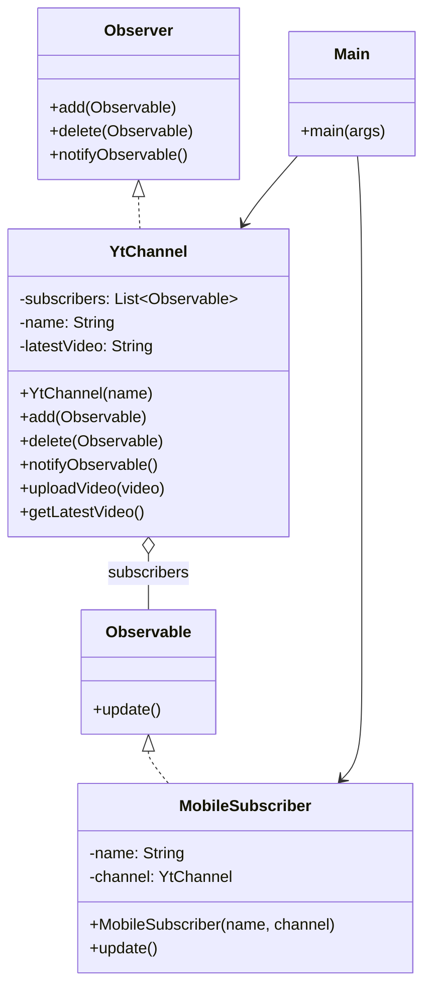

# Observer Pattern (YouTube Channel Example)

This project demonstrates the Observer design pattern using a YouTube channel that notifies subscribers when a new video is uploaded.

## UML (Class Diagram)



## How It Works

- `YtChannel` acts as the subject and keeps a list of `Observable` subscribers.
- `MobileSubscriber` implements `Observable` and reacts to updates.
- When `uploadVideo()` is called, the channel notifies all subscribers.

## Why Use Observer?

- Decouples the subject from its dependents.
- Allows dynamic subscription at runtime.
- Makes event-driven flows easier to extend.

## Run

```powershell
./run.ps1
```

You can pass a custom main class name if needed:

```powershell
./run.ps1 -MainClass Main
```
