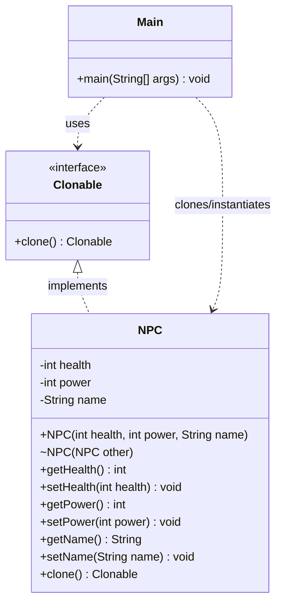

# Prototype Design Pattern - Java Implementation

This repository contains a clean, minimal Java implementation demonstrating the **Prototype Design Pattern**.

## What is the Prototype Design Pattern?

The **Prototype Design Pattern** is a creational design pattern that allows copying existing objects without making the code dependent on their concrete classes. 

Instead of creating a new object from scratch (which could be resource-intensive or complex), the client asks an existing object (the **prototype**) to clone itself.

### Key Components

1. **Prototype Interface**: Declares the cloning interface (typically a single `clone` method). In this project, it is [Clonable.java](file:///c:/Users/Asim/OneDrive/Desktop/projects/LLD-PROJECTS/design-patterns/prototype-design-pattern/src/main/java/Clonable.java).
2. **Concrete Prototype**: Implements the clone method to return a copy of itself. In this project, it is [NPC.java](file:///c:/Users/Asim/OneDrive/Desktop/projects/LLD-PROJECTS/design-patterns/prototype-design-pattern/src/main/java/NPC.java).
3. **Client**: Creates a new object by asking the prototype to clone itself. In this project, it is [Main.java](file:///c:/Users/Asim/OneDrive/Desktop/projects/LLD-PROJECTS/design-patterns/prototype-design-pattern/src/main/java/Main.java).

---

## UML Class Diagram

The class structure of this implementation is visualized below:



---

## Code Structure

- **[Clonable.java](file:///c:/Users/Asim/OneDrive/Desktop/projects/LLD-PROJECTS/design-patterns/prototype-design-pattern/src/main/java/Clonable.java)**: Defines the custom interface `Clonable` returning a typed object, avoiding standard Java clone cast complexities.
- **[NPC.java](file:///c:/Users/Asim/OneDrive/Desktop/projects/LLD-PROJECTS/design-patterns/prototype-design-pattern/src/main/java/NPC.java)**: Represents a Non-Player Character. It implements the `Clonable` interface and uses a copy constructor `NPC(NPC other)` to perform the clone action.
- **[Main.java](file:///c:/Users/Asim/OneDrive/Desktop/projects/LLD-PROJECTS/design-patterns/prototype-design-pattern/src/main/java/Main.java)**: The entry point of the application. It creates an initial `NPC` object (an "orc") and uses it as a prototype to instantiate two clones.

---

## How to Run

A PowerShell script [run.ps1](file:///c:/Users/Asim/OneDrive/Desktop/projects/LLD-PROJECTS/design-patterns/prototype-design-pattern/run.ps1) is provided to quickly compile, execute, and clean up the generated compilation artifacts (`.class` files).

### Prerequisites
- Java Development Kit (JDK) 8 or higher (with `javac` and `java` commands in system PATH).
- PowerShell.

### Execution
Run the following command in your PowerShell terminal inside the project root directory:

```powershell
.\run.ps1
```

Or if Execution Policy blocks execution:
```powershell
powershell -ExecutionPolicy Bypass -File .\run.ps1
```

The script will automatically:
1. Compile the files into a temporary `bin/` directory.
2. Execute the `Main` class.
3. Clean up the `bin/` directory, removing all generated `.class` files.
