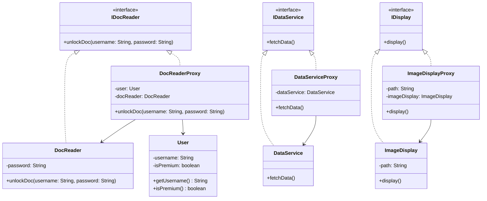

# Proxy Design Pattern

The Proxy Design Pattern is a structural design pattern that provides a surrogate or placeholder for another object to control access to it. This pattern is useful for managing access control, lazy initialization, logging, caching, or remote connections.

This repository implements three common variations of the Proxy pattern:
1. **Protection Proxy**: Controls access to a resource based on authorization rules.
2. **Remote Proxy**: Manages access to an object located in a different address space (simulating remote connection management).
3. **Virtual Proxy**: Defers expensive object creation (lazy initialization) until the object is actually needed.

---

## UML Class Diagram

---

## Detailed Component Descriptions

### 1. Protection Proxy (`protectionproxy` package)
- **`IDocReader`**: The common interface defining the operations.
- **`DocReader`**: The real object containing the sensitive document unlocking action.
- **`DocReaderProxy`**: The proxy object that verifies if a user has premium privileges before delegating the call to the real `DocReader`.
- **`User`**: A helper class containing authorization information.

### 2. Remote Proxy (`remoteproxy` package)
- **`IDataService`**: The interface defining data-fetching operations.
- **`DataService`**: The real service fetching the data from a simulated remote database/server.
- **`DataServiceProxy`**: The proxy that handles the initialization and session/connection establishment when the data is fetched for the first time.

### 3. Virtual Proxy (`virtualproxy` package)
- **`IDisplay`**: The interface for displaying media.
- **`ImageDisplay`**: The real object that represents a heavy resource. Loading it involves resource-intensive tasks (decoding, decompression, filtering).
- **`ImageDisplayProxy`**: The proxy object that holds the image metadata (such as path) but defers the actual loading and creation of `ImageDisplay` until `display()` is called for the first time.
