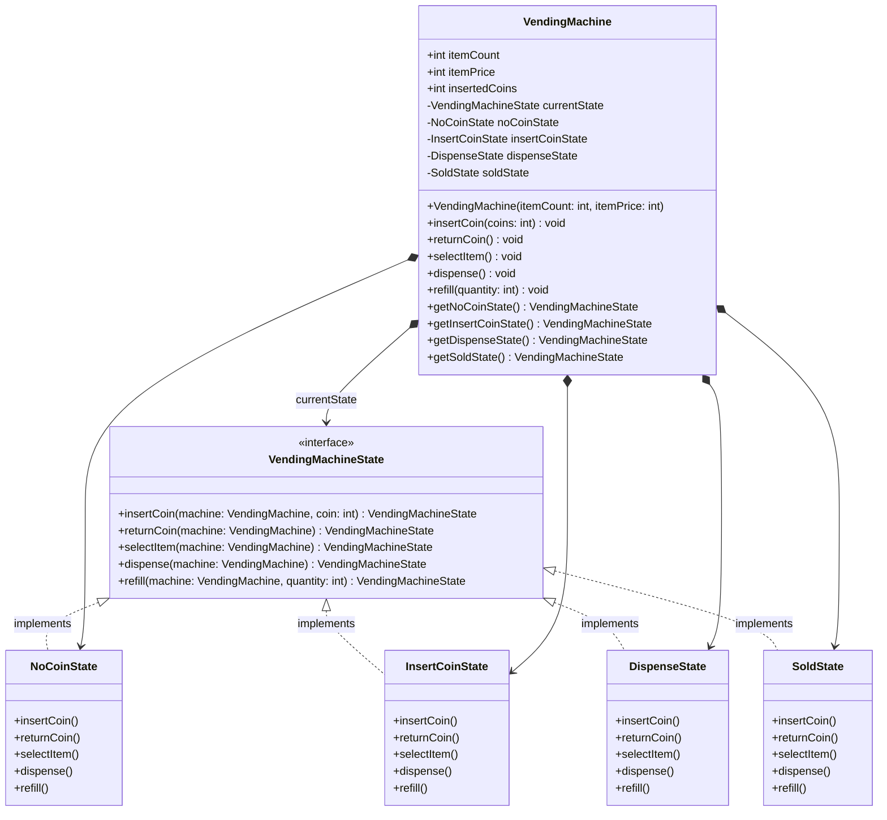
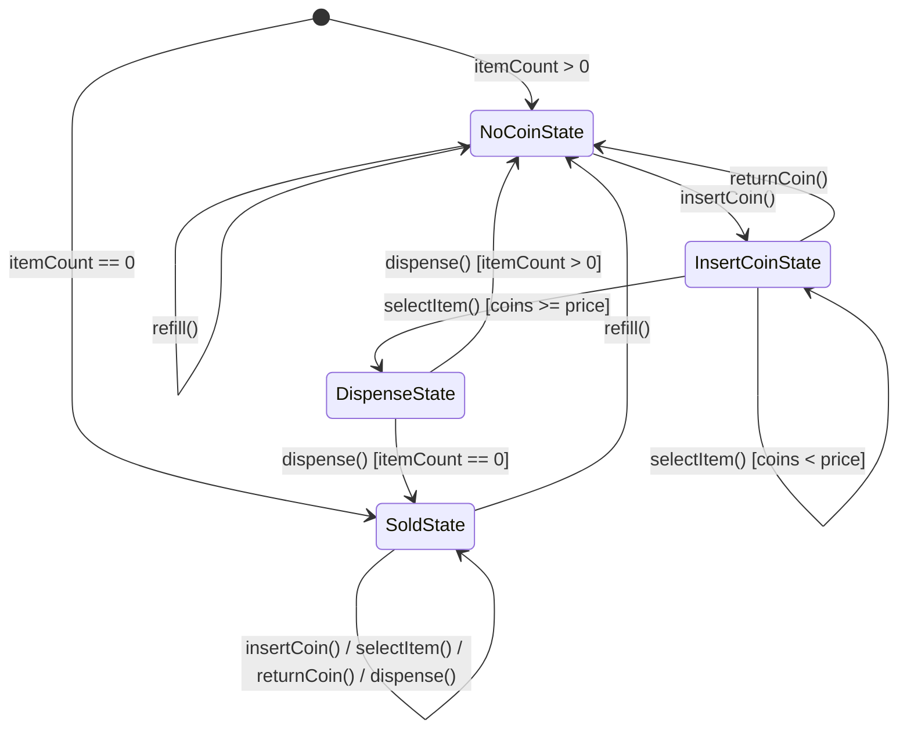

# State Design Pattern - Vending Machine

This repository implements a **Vending Machine** simulation using the **State Design Pattern**, a behavioral design pattern that allows an object to alter its behavior when its internal state changes. The object will appear to change its class.

---

## Table of Contents
1. [Introduction to State Pattern](#introduction-to-state-pattern)
2. [Class Diagram (UML)](#class-diagram-uml)
3. [State Transition Diagram](#state-transition-diagram)
4. [Project Structure](#project-structure)
5. [State Matrix Table](#state-matrix-table)
6. [Compilation & Execution](#compilation--execution)

---

## Introduction to State Pattern

The State Design Pattern is used when an object behaves differently depending on its current state. Instead of using large conditional statements (`if-else` or `switch`), we encapsulate state-specific behavior within individual state classes that implement a common interface.

### Key Components:
- **Context (`VendingMachine`)**: Maintains an instance of a concrete state subclass that defines the current state.
- **State Interface (`VendingMachineState`)**: Defines an interface for encapsulating the behavior associated with a particular state of the Context.
- **Concrete States (`NoCoinState`, `InsertCoinState`, `DispenseState`, `SoldState`)**: Each subclass implements behavior associated with a state of the Context.

---

## Class Diagram (UML)

The relationship between the `VendingMachine` context and its state implementations is shown below:



---

## State Transition Diagram

The vending machine transitions through states based on user interaction:



---

## Project Structure

```
state-design-pattern/
│
├── src/main/java/
│   ├── Main.java               # Entry point
│   ├── context/
│   │   └── VendingMachine.java # The Context class
│   └── states/
│       ├── VendingMachineState.java # The State Interface
│       ├── NoCoinState.java         # State: No coins inserted
│       ├── InsertCoinState.java     # State: Coins inserted
│       ├── DispenseState.java       # State: Item selected, ready to dispense
│       └── SoldState.java           # State: Out of stock
│
├── run.ps1                     # PowerShell build/run script
└── README.md                   # System Documentation
```

---

## State Matrix Table

The table below summaries how each action affects the Vending Machine depending on its current state:

| Action | `NoCoinState` | `InsertCoinState` | `DispenseState` | `SoldState` (Out of Stock) |
|---|---|---|---|---|
| **insertCoin(coin)** | Transitions to `InsertCoinState`. Adds coin. | Stays in `InsertCoinState`. Adds coin. | Prints error (wait transaction). Returns same state. | Prints error (out of stock). Returns coin. |
| **returnCoin()** | Prints error (insert coins first). | Returns all inserted coins. Transitions to `NoCoinState`. | Prints error (wait transaction). | Prints error (no coins). |
| **selectItem()** | Prints error (insert coins first). | Transitions to `DispenseState` if money is sufficient. Decrements inventory. | Prints error (wait transaction). | Prints error (out of stock). |
| **dispense()** | Prints error (insert coins first). | Prints error (select item first). | Dispenses item. Transitions to `NoCoinState` (if stock > 0) or `SoldState` (if stock == 0). | Prints error (out of stock). |
| **refill(qty)** | Adds quantity to stock. | Adds quantity to stock. | Prints error (wait transaction). | Adds quantity to stock. Transitions to `NoCoinState`. |

---

## Compilation & Execution

A PowerShell script `run.ps1` is provided to compile, execute, and clean up build artifacts.

### Prerequisites:
- JDK 8 or higher installed and added to your `PATH`.
- PowerShell execution policy set to run scripts.

### Running the Project:
Execute the following command in the project directory:

```powershell
powershell -ExecutionPolicy Bypass -File .\run.ps1
```

The script will:
1. Compile all `.java` files into a temporary `bin/` directory.
2. Execute the `states.Main` class.
3. Clean up and delete the compiled `.class` files (removing the `bin/` directory).
