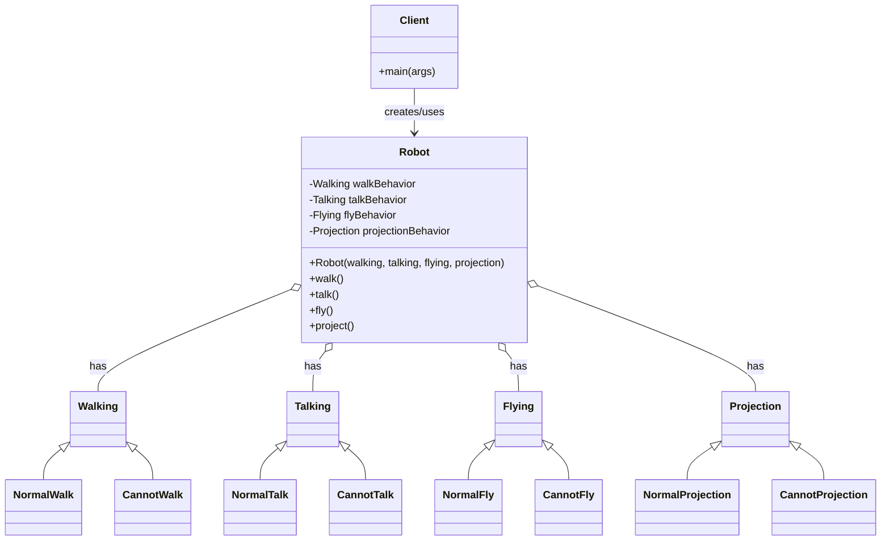

# Strategy Design Pattern — Robot Example

## Project Overview
This repository demonstrates the Strategy design pattern using a simple `Robot` example. The goal is to show how to make an object (`Robot`) configurable with interchangeable behaviors (strategies) for walking, talking, flying, and projection, so behaviors can vary independently of the `Robot` class.

## Problem Statement
You have robots that can perform multiple behaviors: walk, talk, fly, and project. Different robots may use different implementations of each behavior (for example, some robots can fly, some cannot). Using inheritance to cover every possible combination leads to class explosion and rigid code. The Strategy pattern solves this by:

- Extracting each behavior into an interface (strategy).
- Providing multiple strategy implementations (e.g., `NormalWalk`, `CannotWalk`).
- Injecting chosen strategies into the `Robot` at construction or runtime.

This allows composing robots with different combinations of behaviors without creating a separate subclass for each combination.

## Design (How this repo maps to the pattern)
- Context: `Robot` (in `src/main/java/context/Robot.java`) — holds references to strategy interfaces and delegates behavior calls to them.
- Strategies (interfaces): `Walking`, `Talking`, `Flying`, `Projection` (in `src/main/java/strategy/*`).
- Concrete strategies: `NormalWalk`, `CannotWalk`, `NormalTalk`, `CannotTalk`, `NormalFly`, `CannotFly`, `NormalProjection`, `CannotProjection`.
- Client: `Client` (in `src/main/java/client/Client.java`) — composes a `Robot` with specific strategy implementations and invokes behaviors.

## UML Diagram (Mermaid)


Paste the Mermaid block above into any renderer that supports Mermaid (for example, GitHub or VS Code Mermaid Preview) to see the class diagram.

## How to run
From the repository root you can run the included PowerShell script which compiles and runs `Client` and then cleans `bin`:

```powershell
.\run-client.ps1
```

If you prefer manual steps:

```powershell
# Compile
$files = Get-ChildItem -Path src\main\java -Recurse -Filter *.java | ForEach-Object FullName
javac -d bin -sourcepath src\main\java $files

# Run
java -cp bin client.Client
```

## Notes
- The Strategy pattern increases flexibility and reduces subclassing.
- You can change a `Robot`'s behavior at runtime by setting a different strategy object.
- See [run-client.ps1](run-client.ps1) and the source in [src/main/java/client/Client.java](src/main/java/client/Client.java) for concrete usage.
