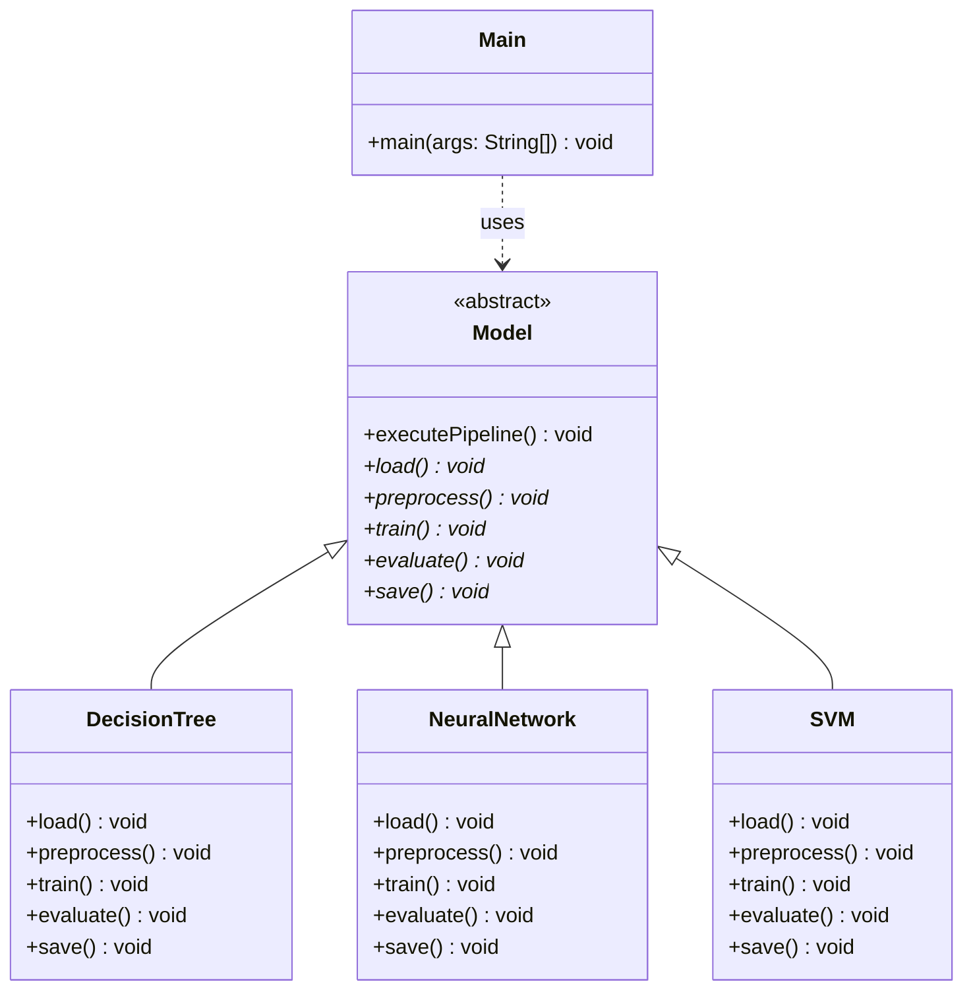

# Template Method Design Pattern

A demonstration of the **Template Method Design Pattern** implemented in Java, modeling a machine learning model training and evaluation pipeline.

---

## Design Pattern Description

The **Template Method Pattern** is a behavioral design pattern that defines the skeleton of an algorithm in a method of a superclass, deferring some steps to subclasses. It lets subclasses redefine certain steps of an algorithm without changing the algorithm's structure.

### Key Characteristics
1. **Template Method**: A method in the base class (often declared `final`) that defines the skeleton/flow of the algorithm. In this project, `Model.executePipeline()` acts as the template method.
2. **Abstract/Primitive Operations**: Steps of the algorithm that must be implemented by concrete subclasses (e.g., `load()`, `preprocess()`, `train()`, `evaluate()`, `save()`).
3. **Hook Methods (Optional)**: Methods in the base class that have default empty or basic implementations, allowing subclasses to hook into the algorithm at specific points if needed.

---

## UML Diagram

The following class diagram shows the structure of the Template Method Pattern implementation:



---

## How to Run

You can build, run, and clean up the project automatically using the provided PowerShell script:

```powershell
.\run.ps1
```
