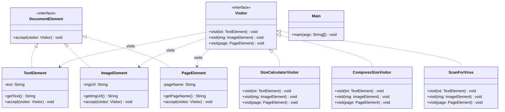

# Visitor Design Pattern — Document Processing System

A clean and premium implementation of the **Visitor Design Pattern** in Java. This project demonstrates how to add new operations (such as size calculation, compression, and virus scanning) to a set of document elements without modifying the structure of the elements themselves.

---

## 📖 Understanding the Visitor Design Pattern

### Intent
The **Visitor Design Pattern** is a behavioral design pattern that lets you separate algorithms from the objects on which they operate. It helps define new operations over a set of classes without modifying the classes themselves.

### The Problem
Imagine a document structure consisting of different types of elements:
- Text (`TextElement`)
- Images (`ImageElement`)
- Pages (`PageElement`)

If we need to perform multiple unrelated operations on these elements (such as calculating size, compressing resource size, or scanning for viruses), adding these methods directly to each element class violates the **Single Responsibility Principle (SRP)** and the **Open/Closed Principle (OCP)**. Every time a new operation is added, we would have to modify all the element classes.

### The Solution: Double Dispatch
The Visitor Pattern uses a technique called **Double Dispatch**:
1. The **Element** interface defines an `accept(Visitor)` method.
2. Concrete elements implement this method by calling `visitor.visit(this)`, passing themselves to the visitor.
3. This delegates the decision of which operation to execute back to the visitor based on both the type of the element (passed as `this`) and the concrete type of the visitor.

---

## 📊 UML Class Diagram

Below is the UML structure representing this implementation:



---

## 🗂️ Project Structure

The project has the following directory layout:

```text
visitor-design-pattern/
├── run.ps1                  # PowerShell runner to compile, run, and clean up
├── README.md                # Project documentation
└── src/
    └── main/
        └── java/
            ├── Main.java    # Driver class orchestrating the flow
            ├── document/    # Package for element classes
            │   ├── DocumentElement.java
            │   ├── TextElement.java
            │   ├── ImageElement.java
            │   └── PageElement.java
            └── visitor/     # Package for visitor operations
                ├── Visitor.java
                ├── SizeCalculatorVisitor.java
                ├── CompressSizeVisitor.java
                └── ScanForVirus.java
```

### File Details
- **Driver Class**: [Main.java](file:///c:/Users/Asim/OneDrive/Desktop/projects/LLD-PROJECTS/design-patterns/visitor-design-pattern/src/main/java/Main.java)
- **Elements**:
  - [DocumentElement.java](file:///c:/Users/Asim/OneDrive/Desktop/projects/LLD-PROJECTS/design-patterns/visitor-design-pattern/src/main/java/document/DocumentElement.java)
  - [TextElement.java](file:///c:/Users/Asim/OneDrive/Desktop/projects/LLD-PROJECTS/design-patterns/visitor-design-pattern/src/main/java/document/TextElement.java)
  - [ImageElement.java](file:///c:/Users/Asim/OneDrive/Desktop/projects/LLD-PROJECTS/design-patterns/visitor-design-pattern/src/main/java/document/ImageElement.java)
  - [PageElement.java](file:///c:/Users/Asim/OneDrive/Desktop/projects/LLD-PROJECTS/design-patterns/visitor-design-pattern/src/main/java/document/PageElement.java)
- **Visitors**:
  - [Visitor.java](file:///c:/Users/Asim/OneDrive/Desktop/projects/LLD-PROJECTS/design-patterns/visitor-design-pattern/src/main/java/visitor/Visitor.java)
  - [SizeCalculatorVisitor.java](file:///c:/Users/Asim/OneDrive/Desktop/projects/LLD-PROJECTS/design-patterns/visitor-design-pattern/src/main/java/visitor/SizeCalculatorVisitor.java)
  - [CompressSizeVisitor.java](file:///c:/Users/Asim/OneDrive/Desktop/projects/LLD-PROJECTS/design-patterns/visitor-design-pattern/src/main/java/visitor/CompressSizeVisitor.java)
  - [ScanForVirus.java](file:///c:/Users/Asim/OneDrive/Desktop/projects/LLD-PROJECTS/design-patterns/visitor-design-pattern/src/main/java/visitor/ScanForVirus.java)

---

## ⚡ Execution

A helper PowerShell script is provided to automate compilation, execution, and cleanup of the generated bytecode artifacts.

### Prerequisites
- Java Development Kit (JDK) installed and configured in your system `PATH`.
- PowerShell execution policy allowing script execution.

### How to Run
Execute the script from the project root directory in a PowerShell console:

```powershell
.\run.ps1
```

### What the script does:
1. Creates a temporary `bin/` directory.
2. Compiles all `.java` files under `src/` to `bin/` using `javac`.
3. Runs the compiled `Main` class.
4. Cleans up and deletes the `bin/` directory and all `.class` artifacts, keeping your source tree perfectly pristine.

---

## ⚖️ Architectural Tradeoffs

| Pros | Cons |
| :--- | :--- |
| **Open/Closed Principle**: You can introduce new behaviors that work with object structures without changing existing classes. | **High Maintenance cost**: Adding a new element class requires updating all existing visitors (adding a new `visit` method). |
| **Single Responsibility Principle**: You can group multiple versions of the same behavior into a single visitor class. | **Encapsulation Breakage**: Visitors might need access to private fields or internal state of elements, which breaks encapsulation. |
| **Accumulating State**: Visitors can collect information/state as they traverse the object structure (e.g. total size). | **Hierarchical dependency**: Works best when the class hierarchy of elements is stable and rarely changes. |
