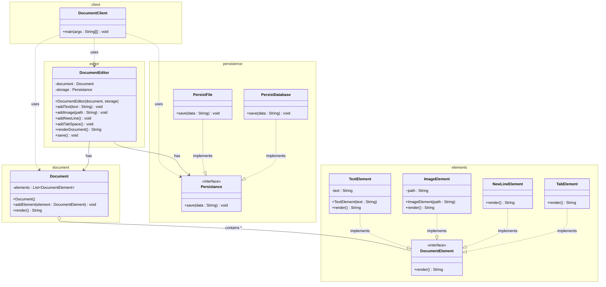

# Google Docs — Class Diagram

```mermaid
classDiagram
    direction TB

    namespace client {
        class DocumentClient {
            +main(args : String[]) void
        }
    }

    namespace editor {
        class DocumentEditor {
            -document : Document
            -storage  : Persistance
            +DocumentEditor(document, storage)
            +addText(text : String) void
            +addImage(path : String) void
            +addNewLine() void
            +addTabSpace() void
            +renderDocument() String
            +save() void
        }
    }

    namespace document {
        class Document {
            -elements : List~DocumentElement~
            +Document()
            +addElement(element : DocumentElement) void
            +render() String
        }
    }

    namespace elements {
        class DocumentElement {
            <<interface>>
            +render() String
        }

        class TextElement {
            -text : String
            +TextElement(text : String)
            +render() String
        }

        class ImageElement {
            ~path : String
            +ImageElement(path : String)
            +render() String
        }

        class NewLineElement {
            +render() String
        }

        class TabElement {
            +render() String
        }
    }

    namespace persistence {
        class Persistance {
            <<interface>>
            +save(data : String) void
        }

        class PersistFile {
            +save(data : String) void
        }

        class PersistDatabase {
            +save(data : String) void
        }
    }

    %% Relationships
    DocumentClient ..> DocumentEditor   : uses
    DocumentClient ..> Document         : uses
    DocumentClient ..> Persistance      : uses

    DocumentEditor  --> Document        : has
    DocumentEditor  --> Persistance     : has

    Document        o-- DocumentElement : contains *

    TextElement     ..|> DocumentElement : implements
    ImageElement    ..|> DocumentElement : implements
    NewLineElement  ..|> DocumentElement : implements
    TabElement      ..|> DocumentElement : implements

    PersistFile     ..|> Persistance     : implements
    PersistDatabase ..|> Persistance     : implements
```