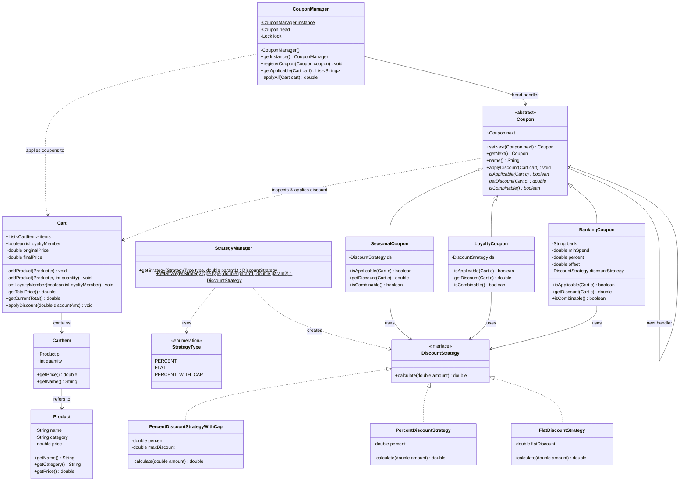

# Discount Coupon Generator (LLD Project)

A low-level design implementation for an e-commerce coupon system that dynamically evaluates, combines, and applies multiple discounts to a shopping cart. The system supports combinable coupons, flat rate discounts, percentage discounts, and capped percentage discounts.

---

## 🏗️ Design Patterns Utilized

This project demonstrates the synergy of three core software design patterns to build a clean, extensible, and thread-safe architecture:

### 1. Chain of Responsibility Pattern
* **Purpose:** Handles the processing of multiple coupons in a pipeline structure.
* **Implementation:** The abstract `Coupon` class represents the base handler holding a reference to the `next` coupon in the chain. Each concrete coupon (`SeasonalCoupon`, `LoyaltyCoupon`, `BankingCoupon`) implements the validation logic (`isApplicable`) and execution (`getDiscount`). It determines if the next handler should execute based on its combinability configuration (`isCombinable()`).

### 2. Strategy Pattern
* **Purpose:** Encapsulates the algorithmic variations of calculating discounts.
* **Implementation:** Concrete strategies (`FlatDiscountStrategy`, `PercentDiscountStrategy`, and `PercentDiscountStrategyWithCap`) implement the `DiscountStrategy` interface. The `StrategyManager` factory creates these strategy objects dynamically, decoupling the discount math from the coupon business logic.

### 3. Singleton Pattern
* **Purpose:** Provides a centralized, thread-safe manager for registering and applying coupons.
* **Implementation:** `CouponManager` employs a thread-safe registry with standard synchronized double-checked locking behavior (`getInstance()`), holding the head of the coupon chain. It manages thread-safe access utilizing `ReentrantLock`.

---

## 📊 UML Class Diagram

The following Mermaid diagram illustrates the classes, interfaces, dependencies, and hierarchy of the project:



---

## 🚀 How to Compile and Run

A helper PowerShell script is provided to automate compilation, execution, and artifact cleanup.

### Prerequisites
* Java Development Kit (JDK 8 or higher) installed and configured in your `PATH`.
* PowerShell console.

### Execution Steps
1. Open a PowerShell terminal in the project directory.
2. Execute the script:
   ```powershell
   powershell -ExecutionPolicy Bypass -File .\run.ps1
   ```

### What the Script Does:
1. Creates a temporary `bin/` directory.
2. Compiles all `.java` source files in the codebase using `javac`.
3. Runs the compiled `Main` entrypoint with `java`.
4. Cleans up and deletes the `bin/` directory, ensuring no compilation artifacts are left in the repository.
