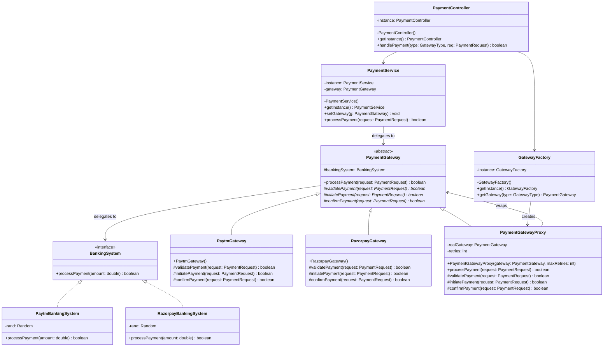

# Payment Gateway Low-Level Design (LLD)

This project demonstrates a clean implementation of a Payment Gateway system in Java applying key Low-Level Design (LLD) patterns.

## Design Patterns Used

### 1. Strategy Pattern
The `BankingSystem` interface acts as the strategy interface for executing bank payments. Concrete implementations (`PaytmBankingSystem` and `RazorpayBankingSystem`) encapsulate different success simulation algorithms and can be dynamically selected and executed.

### 2. Template Method Pattern
The `PaymentGateway` abstract class defines the standard workflow for processing a payment via its `processPayment` method. It establishes a fixed sequence of execution (validate, initiate, and confirm) while leaving concrete subclasses (`PaytmGateway`, `RazorpayGateway`) to implement their own custom step validation and payment triggers.

### 3. Proxy Pattern
`PaymentGatewayProxy` wraps a `PaymentGateway` object to control access and enhance performance. Specifically, it implements resilient retry logic around the payment execution without changing or polluting the real gateway class structures.

### 4. Singleton Pattern
The orchestration and utility classes are designed as Singletons to maintain a single static global instance and reference point:
- `GatewayFactory`: Provides gateway instantiation and wraps them with proxy handlers.
- `PaymentService`: Configures the active gateway context and forwards payment requests.
- `PaymentController`: Entry point dispatching client actions to appropriate sub-services.

---

## UML Class Diagram

