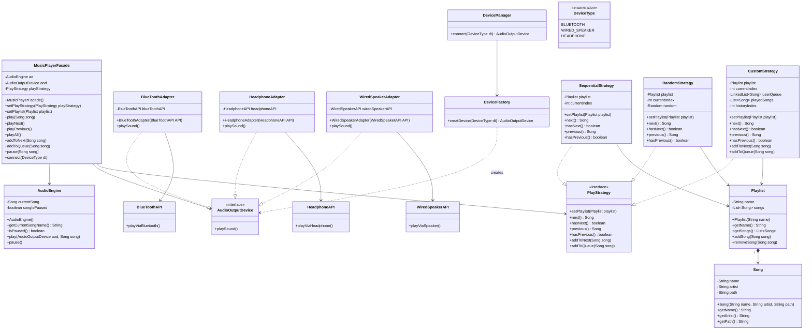

# Spotify Mini-Project (Low-Level Design)

A premium, modular console-based Spotify music player client designed using clean object-oriented principles, design patterns, and robust playback strategies in Java.

---

## 🛠️ Design Patterns Implemented

The architecture leverages several classic structural and behavioral design patterns to ensure decoupling, extensibility, and maintainability:

1. **Facade Pattern (`MusicPlayerFacade`)**
   * Simplifies the complex subsystem interaction (audio playback engine, device manager, and strategy controller) into a single unified interface for the client.
2. **Strategy Pattern (`PlayStrategy`)**
   * Decouples the song selection/iteration logic. Concrete strategies like `SequentialStrategy`, `RandomStrategy`, and `CustomStrategy` (supporting play queue and custom ordering) can be swapped seamlessly.
3. **Adapter Pattern (Device Adapters)**
   * Adapts various external proprietary vendor audio APIs (`BlueToothAPI`, `HeadphoneAPI`, `WiredSpeakerAPI`) to a common application interface (`AudioOutputDevice`).
4. **Factory Pattern (`DeviceFactory`)**
   * Enforces object-creation guidelines by instantiating the correct `AudioOutputDevice` adapter based on the specified `DeviceType` enum.

---

## 🗺️ System Architecture (UML Diagram)

Below is the UML class diagram describing all elements and relations within the system:



---

## 🚀 Getting Started & Execution

A automated script has been provided to build, execute the test runner, and clean up temporary compilation artifacts.

### Prerequisites

* Java Development Kit (JDK) 8 or higher installed and added to your `PATH`.
* PowerShell (standard on Windows).

### Running the Application

Open a PowerShell terminal in the project directory and run:

```powershell
powershell -ExecutionPolicy Bypass -File .\run.ps1
```

This script will:
1. Compile all Java code into the `bin/` directory.
2. Execute the `Main` class runner.
3. Automatically delete all compilation artifacts (cleaning up the `bin/` directory).
