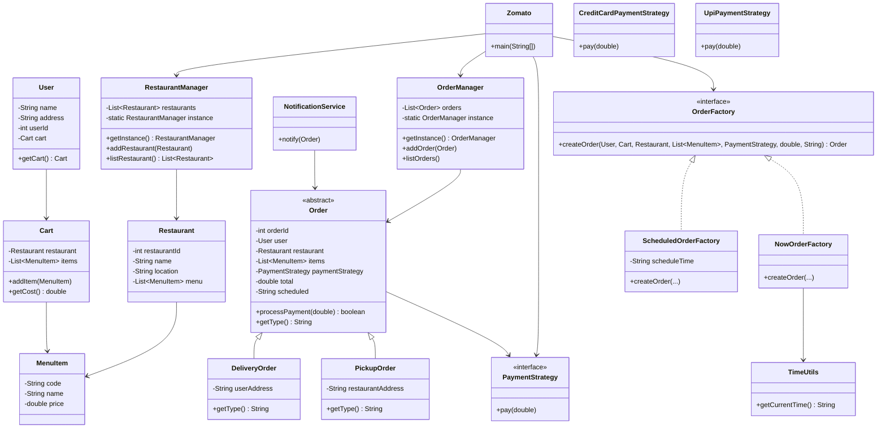

# Zomato LLD Mini Project

## Problem Statement
Build a small, object-oriented food ordering system that supports restaurants, menus, carts, multiple order types (delivery and pickup), payment strategies, and order scheduling. The design should demonstrate common LLD patterns such as factories, strategies, and managers.

## Features
- Restaurant and menu management
- Cart with items and cost calculation
- Delivery and pickup orders
- Instant and scheduled order creation
- Payment strategies (card and UPI)
- Order listing and notification output

## How To Run
From the project root:

```powershell
./run.ps1
```

The script compiles the Java sources, runs the driver in `Zomato`, and cleans build artifacts.

## UML Diagram

